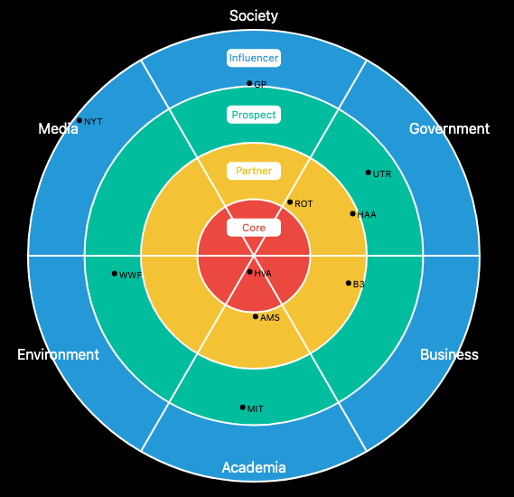

# Degrees of Engagement Diagram Example

This example was built for EWA and Blockchain students that are part of the Degrees of Engagement (DoE) project at AUAS (Amsterdam University of Applied Sciences)

The main objective of this diagram is showing project members, within their categories (e.g. environment, society) and engagement levels (e.g. core, partner). Here, an example of the output:

This project uses the [D3js library](https://d3js.org/), and it was based on the TechRadar example available [here](https://codepen.io/douglaseggleton/pen/YYBWvp)
 
The code is written in Typescript but can be easily ported to Javascript. Thank you, Douglas Eggleton, for this great didactic example!

For other interesting visualisations like graphs, please take a look at [this website](https://openresearch.amsterdam/graph/42629) from the Amsterdam Citihall about open research. 

Marcio Fuckner, PhD
Lecturer/Researcher at HvA

## Running the Application

You should first run `npm install` to download all the required libraries.

Then, you can run the app in development environment using `ng serve`
